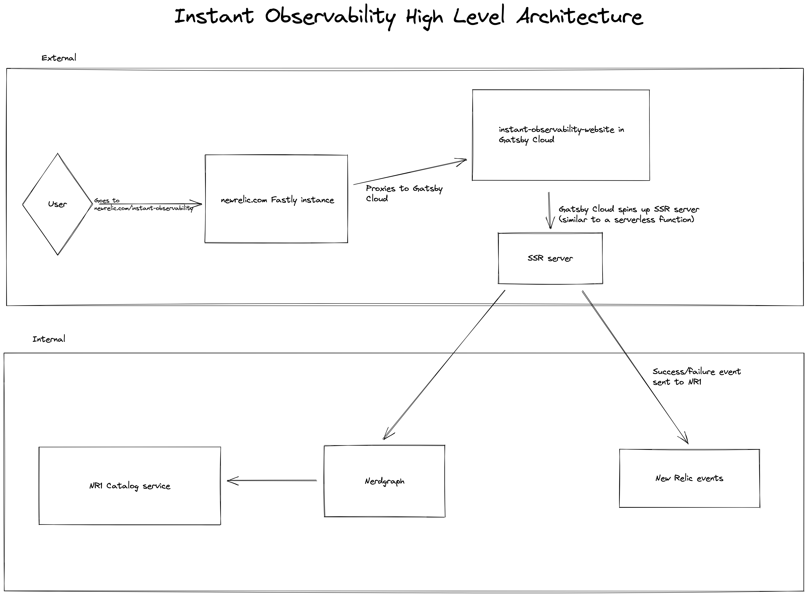

[](https://opensource.newrelic.com/oss-category/#community-project)

# Instant Observability Website

_Dashboards, alerts, and integrations all in one place._  
This site hosts the public version of the Instant Observability Marketplace

### Dependencies

- Node v16 is used in this project as specified in [.nvmrc](https://github.com/newrelic/developer-website/blob/master/.nvmrc).
- Yarn v1.22

## 👷‍♂️ Local development

### Environment

In order to run the site without error, you will need to set a few environment variables so that requests to Nerdgraph can succeed. The easiest way to specify these values is to create a `.env.development` file at the root of the repo. If you want, you can forego the file and run with environment variables set via a different mechanism.

Inside the file, you will want to copy (and replace where appropriate) the following:
```
BRANCH='local'
NERDGRAPH_URL='https://api.newrelic.com/graphql'
NEW_RELIC_API_KEY='KEY_WITH_ACCESS_TO_PROD_NERDGRAPH'
NEW_RELIC_LICENSE_KEY='STAGING_DEVEN_LICENSE_KEY'
```

`NERDGRAPH_URL` (required) - the NerdGraph endpoint the site reaches out to. Value is `https://api.newrelic.com/graphql` for production. If missing, catalog & details pages will fail to load.

`NEW_RELIC_API_KEY` (required) - API key with access to NerdGraph. Against production NERDGRAPH_URL, this will need to be for a user in our production account. If testing against staging, this will instead need to be for a staging user. If missing, catalog & details pages will fail to load.

`NEW_RELIC_LICENSE_KEY` (optional) - ingest license key for our staging account. This is needed to monitor the site in New Relic. The site will still function if the value is missing or incorrect but events will not be sent to New Relic.

`BRANCH` (optional) - unique identifier which is appended to events as `environment`. Default value is `local`. This is used to filtering events across different branches of work. When working locally, we recommend this value be changed to be as unique as possible so you can identify events specific to your work.

### Running the Site

You can serve this site locally to quickly see your changes and additions before you PR them. To get started, navigate into your new site’s directory and start it up, as follows.

```shell
cd developer-website/
yarn install
yarn start
```

Your site is now running at `http://localhost:8000`!

## 🚀 Production Build

You can serve this site locally to quickly see your changes and additions before you PR them. To get started, navigate into your new site’s directory and start it up, as follows.

```shell
cd developer-website/
yarn install
yarn build
yarn serve
```

Your site is now running at `http://localhost:9000`!

### Path prefix
This site supports using a path prefix, allowing the site to work as if it was exposed at `www.somewebsite.com/` while actually being exposed at `www.somewebsite.com/instant-observability`. The value of the prefix is defined in the `gatsby-config.js` file under the `pathPrefix` field. 

To build to the with the path prefix enabled:
```shell
yarn build:production
```

To then serve the built site with path prefixing enabled:
```shell
yarn serve:production
```

## ✅ CI/CD 
#### Gatsby Build Service  
Verifies that your branch can be built and generates a preview build.  
This check is required for merges into `main`.

#### Fetch-quickstarts
Runs every 4 hours to pull in new quickstarts from Nerdgraph (New Relic's GraphQL instance) and commit them to the `main` branch.

#### Fetch related content
Runs every day to get various pages that relate to each quickstart from our vendor.
The quickstart metadata used to query for related pages is pulled down using the local [`gatsby-source-quickstart-metadata`](./gatsby-source-quickstart-metadata/README.md) 

## ☁️  Hosting  

This site is built and hosted on Gatsby Cloud. [insert URL here]  
Changes are published on pushes to `main`.

### Environment variables
|key|possible values|notes|
|-|-|-|
|`GATSBY_NEWRELIC_ENV`|`development` or `production`| Used by the [New Relic Gatsby Theme](https://github.com/newrelic/gatsby-theme-newrelic) to determine the running environment. Set to `production` on prod.|
|`PREFIX_PATHS`|`true` or `false`|Enables path prefixing during builds and deployments. Set to `true` on prod.|
|`NEW_RELIC_API_KEY`|value of the api key|Used to query for quickstarts on page request and during build|
|`NERDGRAPH_URL`|most likely `https://api.newrelic.com/graphql`|Used to query for quickstarts on page request and during build|
|`NEW_RELIC_LICENSE_KEY`|a license key associated with a New Relic account|Used to send custom events to the New Relic platform|

## Software architecture
This site utilizes the [server side rendering](https://www.gatsbyjs.com/docs/reference/config-files/gatsby-ssr/) API from Gatsby to render the I/O catalog and quickstart details pages. See [Rendering Options](https://www.gatsbyjs.com/docs/how-to/rendering-options/) for more details on the difference between rendering options in Gatsby. The quickstarts are pulled in at request time from Nerdgraph, instead of at build time like a traditional Gatsby site. This allows us to serve up to date information, instead of requesting it on a cron schedule.



## 🩹 Support

New Relic has open-sourced this project. This project is provided AS-IS WITHOUT WARRANTY OR DEDICATED SUPPORT. Issues and contributions should be reported to the project here on GitHub.

We encourage you to bring your experiences and questions to the [Explorers Hub](https://discuss.newrelic.com/t/opensource-newrelic-com/104943) where our community members collaborate on solutions and new ideas.

## 🚧 Contribute

We welcome contributions to the New Relic Developer Site. Please review our
[Contributors Guide](CONTRIBUTING.md) prior to submitting any code.

Keep in mind when you submit your pull request, you'll need to sign the CLA via the click-through using CLA-Assistant. You only have to sign the CLA one time per project. If you have any questions, or to execute our corporate CLA, required if your contribution is on behalf of a company, please drop us an email at opensource@newrelic.com.


## 🖋 License
Instant Observability Website is licensed under the [Apache 2.0](http://apache.org/licenses/LICENSE-2.0.txt) License.
>The Instant Observability Website also uses source code from third-party libraries. You can find full details on which libraries are used and the terms under which they are licensed in the third-party notices document.
